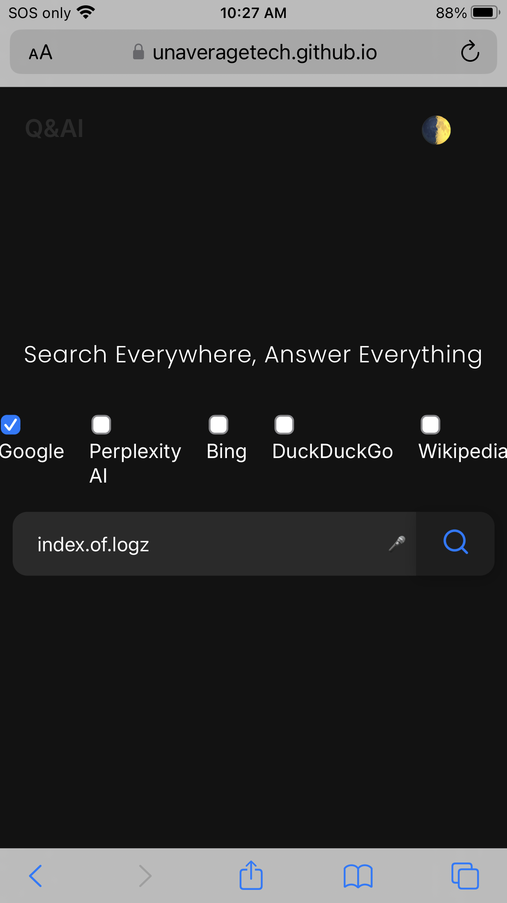

---

### Exploring Web Development Conversations with `index.of.logz`

While using advanced search techniques like **Google Dorking**, we stumbled upon a valuable resource through the query `index.of.logz`, which led us to a fascinating page hosting a collection of web development conversations spanning from 2007 to 2024. You can explore these logs yourself here: [GnuCash Logs](https://lists.gnucash.org/logs/).

This archive provides an insightful look into the evolution of web development discussions over nearly two decades, covering a wide range of topics from early HTML practices to modern frameworks and best practices.

To uncover such gems, we used the following Google Dork query to search for publicly accessible server directories containing logs:

```
intitle:"index of /" inurl:index.of.logz
```

This query helps identify open directories where logs of conversations, server activities, or other data might be stored. It is a powerful way to explore logs while applying specific filters to target the desired content more effectively.

The [GnuCash logs](https://lists.gnucash.org/logs/) are especially useful for:

- **Web Development History**: Observing how trends, tools, and technologies have shifted over time.
- **Problem-Solving**: Learning from past conversations and solutions to common development challenges.
- **Insight into Collaboration**: Understanding how developers and teams collaborated in an open-source environment.

Below is an example of the query using the html provided:



**Using Google Dorking responsibly**: When exploring open directories like this, it’s important to remember that not all data is meant to be public. As always, ethical practices should guide your exploration, focusing on improving security, education, and awareness in the tech community.

If you’re interested in exploring more, try out the following advanced search queries tailored to find log files:

```
inurl:log intitle:"index of /"
```

This can help you locate other publicly available logs or archives of conversations, documentation, or even server processes that might offer valuable insights.

**Disclaimer**: Always ensure you're accessing and using information ethically and legally. The goal is to raise awareness about online security and uncover resources for educational purposes.

---

